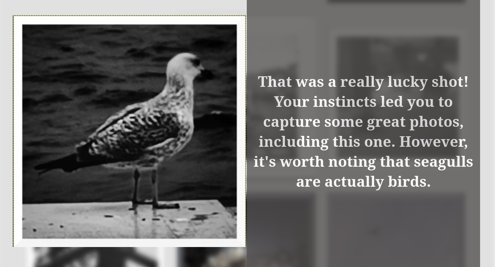

This gets random sections from a stream video.

Each section is of variable duration.

Then it joins them into a single video.

You can use the HUGE_URL env var.
The output name can be ommitted to use a random name.

## Installation

git clone this somewhere.

Make a shell alias:

```alias hgg="python ~/code/hugegull/main.py"```

Edit ~/.config/hugegull/hugegull.conf

It is empty but you can make it look like this:

```
path = "/home/memphis/toilet"
duration = 45
fps = 30
crf = 30
```

## Usage

```hgg https://something.m3u8```

Or:

```
export HUGE_URL="https://something.m3u8"
hgg
```