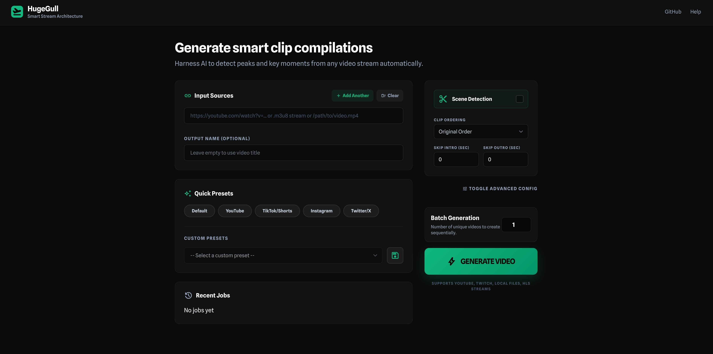

# HugeGull

*A fork of [madprops/hugegull](https://github.com/madprops/hugegull) featuring a Web UI and enhancements.*

Generate smart clip compilations from video streams.

## ✨ Features

- 🎬 **Smart Scene Detection** - Find actual scene changes instead of random timestamps
- 👁️ **Preview Mode** - See planned clips before generating
- ⏭️ **Skip Intros/Outros** - Exclude unwanted sections automatically
- 🔄 **Resume Support** - Continue interrupted jobs
- 🌐 **Web UI** - Browser interface with real-time progress
- 📐 **Multiple Formats** - 16:9, 9:16 (vertical), 1:1, 4:5 aspect ratios
- 🚀 **GPU Acceleration** - NVIDIA, AMD, and Intel Quick Sync support

## 🚀 Quick Start

### Interactive Setup (Recommended for first-time users)

```bash
# Install with web UI support
pipx install git+https://github.com/binkiewka/hugegull-web.git --force
pipx inject hugegull-web fastapi uvicorn websockets python-multipart aiofiles

# Run setup wizard
hugegull-web-setup
```

The setup wizard will help you configure:
- Output directory
- Default video settings
- GPU encoding
- Scene detection preferences

### Manual Installation

```bash
# Install with all features (including web UI)
pipx install git+https://github.com/binkiewka/hugegull-web.git --force
```

Or clone and install:
```bash
git clone https://github.com/binkiewka/hugegull-web.git
cd hugegull-web
pip install -e .
```

## 📝 Usage

### Basic CLI

```bash
# Basic usage
hugegull-web https://youtube.com/watch?v=... highlights

# With scene detection (smart cuts)
hugegull-web https://youtube.com/watch?v=... --scene-detection

# Preview mode (see what clips will be extracted)
hugegull-web https://youtube.com/watch?v=... --preview

# Skip intro and outro
hugegull-web stream.m3u8 --skip-start 30 --skip-end 60

# Vertical video for TikTok/Shorts
hugegull-web https://youtube.com/watch?v=... --aspect-ratio 9:16

# Resume interrupted job
hugegull-web https://youtube.com/watch?v=... --resume
```

### Web UI

```bash
hugegull-web-ui
# Open http://localhost:28472 in your browser
# Or: hugegull-web-ui --port 8080 to use a different port
```

The web UI includes:
- Visual clip preview
- Preset configurations (YouTube, TikTok, Instagram)
- Real-time progress tracking
- Scene detection toggle
- Drag-and-drop URL input

### Environment Variables

```bash
export HUGE_URL="https://stream.m3u8"
export HUGE_NAME="my_video"
hugegull-web  # Uses env vars
```

## ⚙️ Configuration

Edit `~/.config/hugegull-web/config.toml`:

```toml
# Output settings
path = "/home/user/Videos/hugegull-web"
duration = 45
fps = 30
crf = 28  # Quality: 18-35 (lower = better)

# GPU encoding: "nvidia", "amd", "intel", or "" for CPU
gpu = "nvidia"

# Clip duration range
min_clip_duration = 3.0
avg_clip_duration = 6.0
max_clip_duration = 9.0

# Scene detection
scene_detection = false
scene_threshold = 0.3

# Skip intros/outros (seconds)
skip_start = 0
skip_end = 0

# Fade between clips
fade = 0.03
```

## 🎬 Command Line Options

```
Core options:
  --config <path>          Use custom config file
  --gpu <type>             GPU encoding: amd, nvidia, intel
  --open                   Open video when complete

Scene detection:
  --scene-detection        Detect scene changes (smart cuts)
  --scene-threshold <n>    Sensitivity (0.1-0.5, default: 0.3)
  --sort-by scene_score    Sort clips by action intensity

Preview & planning:
  --preview, --dry-run     Show planned clips without generating

Skip intros/outros:
  --skip-start <sec>       Skip first N seconds
  --skip-end <sec>         Skip last N seconds

Resume & ordering:
  --resume                 Resume interrupted job
  --shuffle                Randomize clip order
  --sort-by <method>       Sort: index, scene_score, random

Output options:
  --aspect-ratio <ratio>   16:9, 9:16, 1:1, 4:5
  --format <ext>           mp4, webm, mov

Web UI:
  hugegull-web-ui          Start web interface
  
Setup:
  hugegull-web-setup       Run interactive setup wizard
```

## 🎯 Examples

### YouTube Highlights
```bash
hugegull-web https://youtube.com/watch?v=... --scene-detection --duration 60
```

### TikTok/Shorts Compilation
```bash
hugegull-web https://youtube.com/watch?v=... --aspect-ratio 9:16 --duration 30
```

### Stream Highlights (Skip intro)
```bash
hugegull-web https://twitch.tv/videos/... --skip-start 120 --scene-detection
```

### Batch Processing with Web UI
```bash
hugegull-web-ui
# Open browser, paste multiple URLs, queue them up
```

## 🔧 Requirements

- Python 3.8+
- ffmpeg
- yt-dlp (optional, for YouTube/Twitch support)

## 📄 License

MIT License - See LICENSE file
